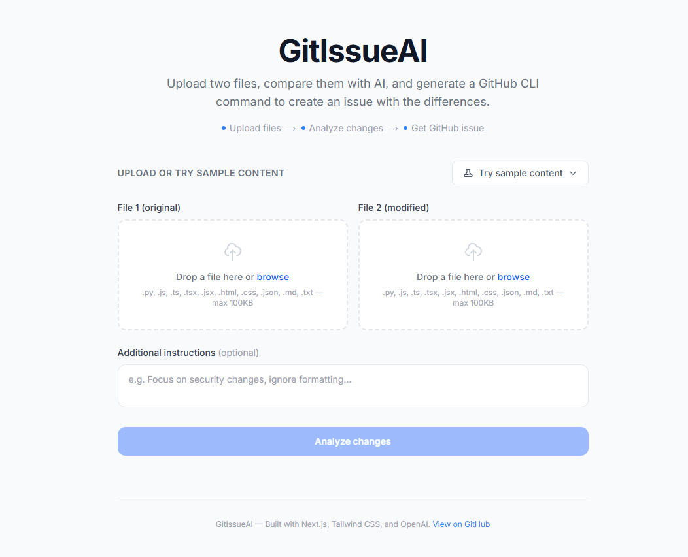
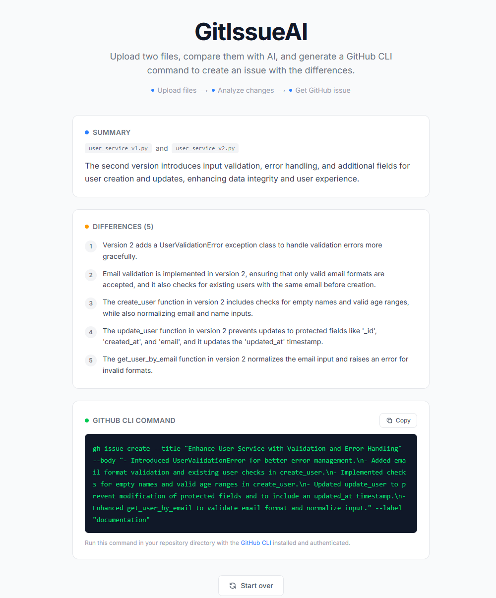

# GitIssueAI

**Compare two files with AI. Get a GitHub issue in one click.**

GitIssueAI is a developer tool that takes two versions of a file, analyzes the differences using OpenAI, and generates a ready-to-run GitHub CLI command to create a well-formatted issue — saving time on code reviews, documentation updates, and change tracking.

> Upload two files → AI identifies meaningful changes → Copy a `gh issue create` command

---

## Screenshots

| Upload files | AI results |
|:---:|:---:|
|  |  |

> *Add your own screenshots to a `screenshots/` folder, or replace these paths with hosted image URLs.*

---

## Features

- **AI-powered file comparison** — Identifies meaningful, grouped differences between two file versions using OpenAI (GPT-4o-mini)
- **Structured results** — Returns a concise summary, a numbered list of changes, and a ready-to-run `gh issue create` command
- **Drag-and-drop uploads** — Clean file upload UX with type and size validation
- **Sample content built in** — Three demo file pairs (Python, HTML, Markdown) let you try the app instantly without uploading anything
- **One-click copy** — Copy the generated GitHub CLI command to your clipboard
- **Custom instructions** — Optionally guide the AI to focus on specific types of changes
- **10 file types supported** — `.py` `.js` `.ts` `.tsx` `.jsx` `.html` `.css` `.json` `.md` `.txt`
- **Responsive design** — Works on desktop and mobile
- **Server-side only API calls** — Your OpenAI key is never exposed to the browser

---

## Tech Stack

| Layer | Technology |
|-------|-----------|
| Framework | [Next.js 15](https://nextjs.org) (App Router) |
| Language | [TypeScript](https://typescriptlang.org) |
| Styling | [Tailwind CSS 4](https://tailwindcss.com) |
| AI | [OpenAI API](https://platform.openai.com) (GPT-4o-mini, server-side) |
| Deployment | [Vercel](https://vercel.com) |

No authentication. No database. Just a clean single-page tool.

---

## Getting Started

### Prerequisites

- **Node.js** 18 or higher
- **npm** 9+
- An **OpenAI API key** — [get one here](https://platform.openai.com/api-keys)

### Local Setup

```bash
# Clone the repository
git clone https://github.com/emil3h/GitIssueAI.git
cd GitIssueAI

# Install dependencies
npm install

# Configure environment
cp .env.example .env.local
```

Open `.env.local` and add your key:

```
OPENAI_API_KEY=sk-your-api-key-here
```

Start the dev server:

```bash
npm run dev
```

Open [http://localhost:3000](http://localhost:3000) and you're ready to go.

### Environment Variables

| Variable | Required | Description |
|----------|----------|-------------|
| `OPENAI_API_KEY` | Yes | Your OpenAI API key |

---

## Deploy to Vercel

1. Push this repository to GitHub
2. Go to [vercel.com/new](https://vercel.com/new) and import the repo
3. In **Settings → Environment Variables**, add:
   - `OPENAI_API_KEY` = your OpenAI key
4. Click **Deploy**

Vercel auto-detects Next.js — no extra configuration needed. Your app will be live in under a minute.

---

## How It Works

```
┌─────────────┐     ┌──────────────────┐     ┌─────────────────┐
│  Upload two  │ ──▶ │  /api/compare    │ ──▶ │  OpenAI GPT-4o  │
│  files       │     │  (server-side)   │     │  mini           │
└─────────────┘     └──────────────────┘     └────────┬────────┘
                                                       │
                    ┌──────────────────┐               │
                    │  Structured JSON │ ◀─────────────┘
                    │  response        │
                    └────────┬─────────┘
                             │
              ┌──────────────┴──────────────┐
              │                             │
     ┌────────▼────────┐         ┌──────────▼──────────┐
     │  Summary +      │         │  gh issue create     │
     │  Differences    │         │  CLI command         │
     └─────────────────┘         └──────────────────────┘
```

1. User uploads two text files (or picks a built-in sample pair)
2. File contents are sent to the `/api/compare` Next.js API route
3. The server builds a structured prompt and calls the OpenAI API
4. OpenAI returns JSON with a summary, differences list, and issue metadata
5. The app renders the results and generates a `gh issue create` command
6. User copies the command and runs it in their repo

---

## Project Structure

```
src/
├── app/
│   ├── api/compare/route.ts    # Server-side API endpoint
│   ├── globals.css              # Tailwind CSS imports
│   ├── layout.tsx               # Root layout with metadata
│   └── page.tsx                 # Single-page application
├── components/
│   ├── FileUpload.tsx           # Drag-and-drop file upload with validation
│   ├── Header.tsx               # App title and how-it-works steps
│   ├── Results.tsx              # Summary, differences, CLI command output
│   └── SampleDropdown.tsx       # Sample content selector dropdown
├── data/
│   └── samples.ts               # Three built-in sample file pairs
└── lib/
    ├── constants.ts             # Allowed file types, size limits
    ├── openai.ts                # OpenAI prompt and API integration
    ├── types.ts                 # Shared TypeScript interfaces
    └── validation.ts            # File extension and size validation
```

---

## V2 Roadmap

- **Diff preview** — Side-by-side syntax-highlighted diff before AI comparison
- **Model selector** — Choose between GPT-4o, GPT-4o-mini, or other models
- **Batch mode** — Compare multiple file pairs and generate a single issue
- **Direct GitHub integration** — Create issues via the GitHub API without the CLI
- **Comparison history** — Local storage-based history of past comparisons
- **Custom labels and assignees** — Configure GitHub issue metadata before generating

---

## License

MIT
